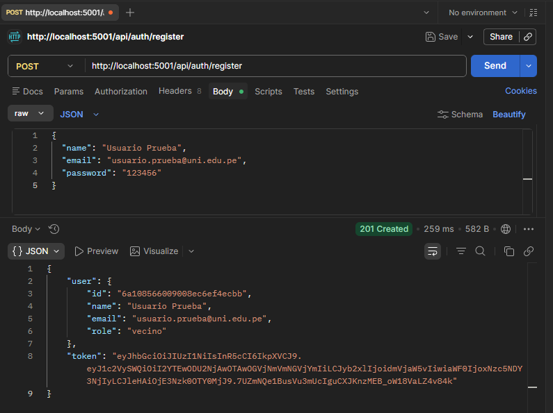
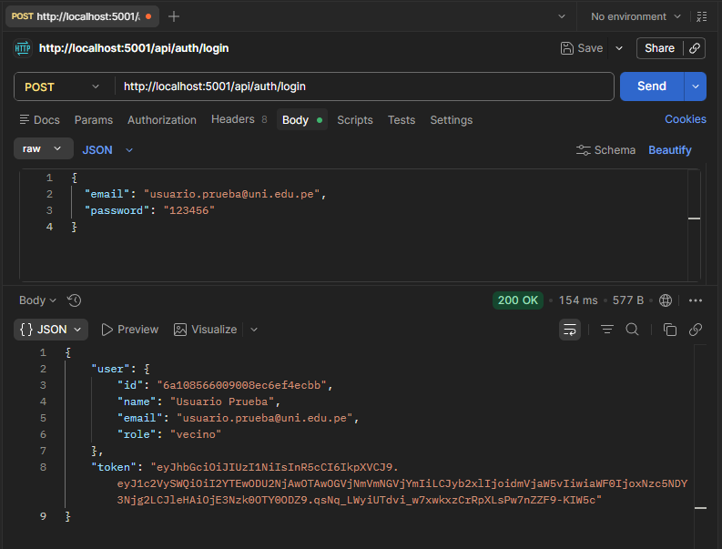
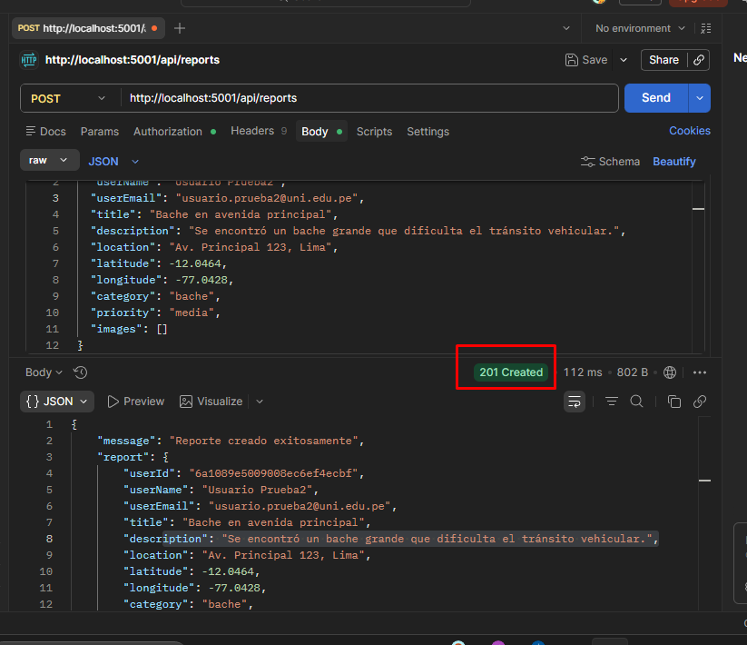
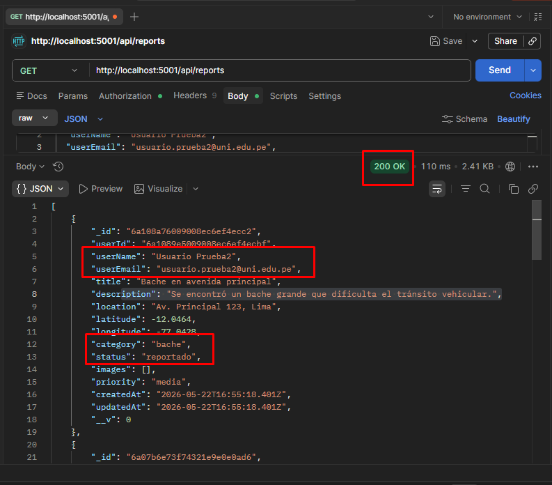
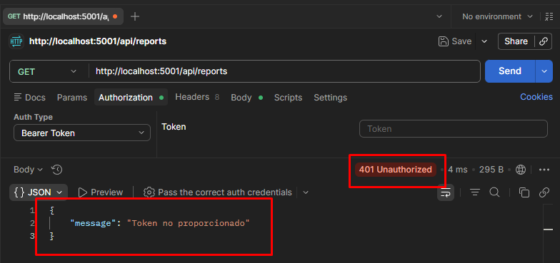
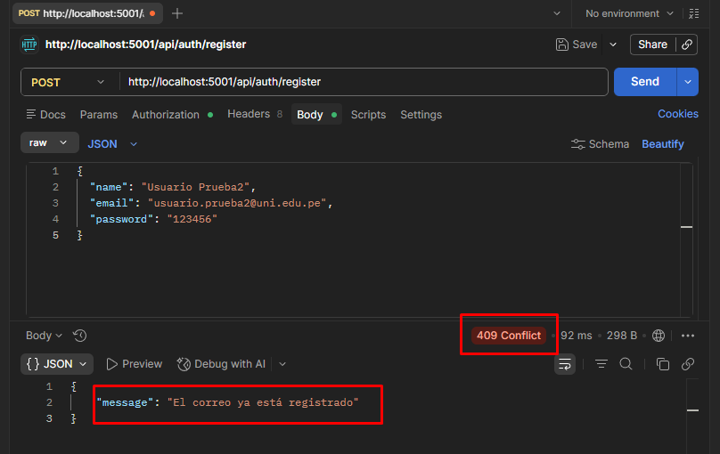

## Implementación de patrones creacionales Practica Calificada 2

En el backend del proyecto se implementaron dos patrones creacionales con el objetivo de mejorar la organización del código, separar responsabilidades y facilitar el mantenimiento futuro de la aplicación.

Los patrones implementados fueron:

- Singleton Pattern
- Builder Pattern

---

### Singleton Pattern

El patrón Singleton se implementó en el archivo:

```txt
backend/config/db.js
```

Este patrón se aplicó para controlar la conexión con MongoDB Atlas, asegurando que el backend reutilice una única instancia de conexión a la base de datos durante la ejecución del servidor.

Con esta implementación, si la conexión ya existe, el sistema reutiliza la misma instancia en lugar de crear una nueva conexión.

#### Beneficios

- Evita múltiples conexiones innecesarias a MongoDB.
- Centraliza la lógica de conexión a la base de datos.
- Mejora el control de recursos del backend.
- Mantiene una única instancia de conexión activa.

---

### Builder Pattern

El patrón Builder se implementó para ordenar la creación de reportes de incidencias urbanas.

Se creó el archivo:

```txt
backend/builders/ReportBuilder.js
```

Y se utilizó en:

```txt
backend/routes/reports.js
```

Este patrón permite construir el objeto `Report` paso a paso antes de guardarlo en la base de datos.

Antes, el reporte se construía directamente dentro de la ruta usando un objeto grande en `Report.create()`. Con Builder, la construcción del reporte se separa en una clase especializada, haciendo que el código sea más limpio, legible y fácil de mantener.

#### Métodos principales del Builder

```txt
setUser()
setBasicInfo()
setCoordinates()
setCategory()
setPriority()
setImages()
build()
```

#### Beneficios

- Ordena la creación de objetos `Report`.
- Separa la lógica de construcción del objeto de la lógica de la ruta.
- Hace más legible el código del backend.
- Facilita agregar nuevos campos al reporte en el futuro.
- Reduce el acoplamiento dentro de `routes/reports.js`.

---

### Archivos modificados y creados

```txt
backend/config/db.js
backend/routes/reports.js
backend/builders/ReportBuilder.js
```

#### Detalle de cambios

```txt
backend/config/db.js
```

Se modificó para aplicar el patrón Singleton en la conexión con MongoDB Atlas.

```txt
backend/builders/ReportBuilder.js
```

Se creó este archivo para implementar el patrón Builder y construir objetos `Report` de forma ordenada.

```txt
backend/routes/reports.js
```

Se modificó la ruta de creación de reportes para utilizar `ReportBuilder` antes de guardar el reporte en MongoDB.

---

## Pruebas de API con Postman

Se realizaron pruebas de los principales endpoints del backend utilizando Postman, con el objetivo de verificar que la autenticación, el registro de usuarios y la gestión de reportes funcionen correctamente después de implementar los patrones creacionales.

Las capturas de las pruebas se guardaron en la carpeta:

```txt
docs/Patrones creacionales Prubeas en Postman/
```

---

### Endpoints probados

| N.º | Método | Endpoint | Descripción |
|---:|---|---|---|
| 1 | GET | `/` | Verifica que el backend esté activo |
| 2 | POST | `/api/auth/register` | Registra un nuevo usuario |
| 3 | POST | `/api/auth/login` | Inicia sesión y genera un token JWT |
| 4 | POST | `/api/reports` | Crea un nuevo reporte de incidencia |
| 5 | GET | `/api/reports` | Lista los reportes registrados |
| 6 | GET | `/api/reports` sin token | Verifica la protección de rutas privadas |
| 7 | POST | `/api/auth/register` con correo repetido | Verifica la validación de usuario duplicado |

---

### Capturas de pruebas

#### 1. Backend activo


#### 2. Registro de usuario



#### 3. Inicio de sesión



#### 4. Creación de reporte



#### 5. Listado de reportes



#### 6. Ruta protegida sin token



#### 7. Usuario duplicado



---

### Resultado de las pruebas

Las pruebas realizadas confirmaron que el backend responde correctamente, que la autenticación mediante JWT funciona y que los reportes pueden ser creados y consultados desde la API.

También se verificó que las rutas protegidas requieren un token válido para permitir el acceso.

---

## Conclusión técnica

La implementación de los patrones Singleton y Builder mejora la arquitectura interna del backend sin alterar el funcionamiento principal de la aplicación.

El patrón Singleton permite manejar de forma controlada la conexión con MongoDB Atlas, mientras que el patrón Builder permite construir reportes de incidencias urbanas de manera más ordenada y mantenible.

Estos cambios no modifican las rutas, los endpoints ni el comportamiento del frontend, pero sí hacen que el código sea más limpio, escalable y preparado para futuras mejoras.